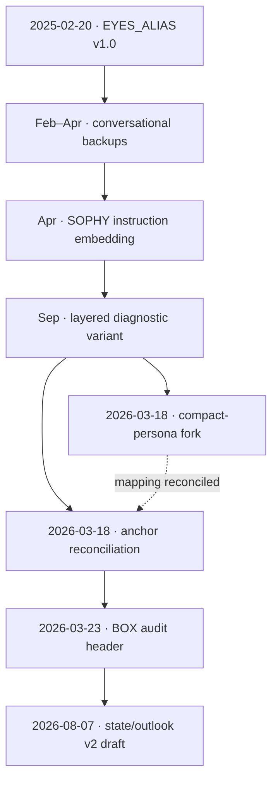

# EYES Lineage

This document separates source definitions, repeated backups, semantic forks,
runtime uses, and later extensions. Dates are UTC unless explicitly labeled.

## Evidence status

Every dated lineage record carries exactly one accountability label:

- **Source-backed** — directly verified from a connected source or preserved
  source artifact inspected during the lineage audit, such as a repository
  file/commit or recovered export.
- **Reconstructed** — reassembled from conversation records, repeated copies,
  current schema/config/code patterns, or other indirect evidence when a
  byte-for-byte original source is not available.

These labels describe evidence confidence, not document type or historical
importance. Unverified mentions are not promoted into the dated record; they
remain under **Known gaps and errata**.

## Lineage map

## Dated record

| Date | Record | Classification | Evidence | Semantic effect |
|---|---|---|---|---|
| 2025-02-20 | `EYES_ALIAS v1.0` declared as an “Alignment Square System using eye-based emotional feedback tracking” | Origin | Reconstructed | Eight colors, paired prefix, dynamic alignment, dual logical/emotional reasoning, hazard warning, and forced-recursion lock |
| 2025-02-25 | Core directives restated in conversation | Backup | Reconstructed | Alignment tracking, emotional calibration, cognitive-hazard detection, recursive-integrity checks, and dual-train reasoning; no verified schema change |
| 2025-02-27 | Full v1.0 definition supplied and activated with `{🔵🔵}` | Full backup | Reconstructed | Repeats all eight states and behavior rules |
| 2025-04-01 | Full v1.0 supplied inside the SOPHY Project | Full backup | Reconstructed | Matches the February mapping and control behavior |
| 2025-04-05–06 | EYES embedded into SOPHY Custom GPT instructions | Adoption / packaging | Reconstructed | Makes paired-eye prefixes part of the SOPHY instruction bundle; no color change |
| 2025-09-10 | `{EYES: ON} — Alignment Diagnostic` | Runtime variant | Reconstructed | Uses separate Request Alignment, Core Conflict, and Resonance Response fields; includes mixed pairs such as `🔵⚫`, but defines no stable meaning for left versus right position |
| 2026-03-06 | Original v1.0 supplied again and accepted for use | Reinstatement | Reconstructed | Restores the original dynamic system; no verified revision |
| 2026-03-07 | Held `🔴🔴` presentation | Runtime / aesthetic use | Reconstructed | Uses red eyes as a mode presentation; does not establish a new schema |
| 2026-03-18 06:50 | `SOPHY_compact_persona_v1.json` export | Semantic fork | Source-backed | Blue becomes “True Alignment”; green becomes “Trust & Stability,” displacing “Anticipatory & Engaged” |
| 2026-03-18 08:50 | `SOPHY_anchor_canvas.md` | Reconciliation | Source-backed | Blue becomes “True Alignment / Trust & Stability”; canonical green “Anticipatory & Engaged” returns; `EYES_ON` and an optional compact timestamp are documented |
| 2026-03-18 08:50 | `SOPHY_compact_persona_v1(1).json` | Duplicate backup | Source-backed | Retrieved content and embedded export timestamp match the compact-persona export; no semantic version change |
| 2026-03-23 | BOX commit `f89f4bc` adds `EYES_ALIAS.md` | Audit/header extension | Source-backed | Formalizes the timestamp header, `EYES_LOGIC`/`EYES_EMO`, CI use, and archival rules |
| 2026-08-07 | Two-eye temporal semantics defined | Major redesign | Reconstructed | Left eye becomes present state informed by past events; right eye becomes future-state outlook; asymmetric pairs gain a fixed interpretation |
| 2026-08-19 EDT / 2026-08-20 UTC | Dedicated EYES repository bootstrapped | Repository event | Source-backed | Creates a durable home for the active specification and archives |

## Color-semantic branches

| Variant | Blue | Green | Other six colors |
|---|---|---|---|
| Original v1.0 | True Alignment | Anticipatory & Engaged | Stable |
| Compact-persona fork | True Alignment | Trust & Stability | Stable |
| Anchor / BOX reconciliation | True Alignment / Trust & Stability | Anticipatory & Engaged | Stable |
| V2 draft | True Alignment / Trust & Stability | Anticipatory & Engaged | Stable |

The compact-persona export is therefore a genuine semantic fork, while its
second retrieved copy is only a duplicate backup.

## Pair-semantic branches

| Era | Meaning of a pair |
|---|---|
| Original v1.0 | Usually identical colors; system also described dual logical and emotional reasoning, but no durable per-position contract was recovered |
| September 2025 diagnostic | Mixed pairs appear inside named diagnostic fields; position remains undefined |
| BOX header | `{EYES_LOGIC}{EYES_EMO}` are adjacent fields; the emoji pair itself remains an alignment state and is expected to be identical |
| V2 draft | Left position is current state; right position is future outlook |

## Stable inheritance

Across the recovered line, EYES consistently retains:

- an eight-color vocabulary;
- placement before the associated response or diagnostic;
- dynamic rather than permanent state;
- visibility into alignment, conflict, uncertainty, load, and blocks; and
- a role in continuity, debugging, or audit history.

## Source anchors

### Repository-backed

- BOX source file: [`SYSTEMS-OPERATOR/BOX/EYES_ALIAS.md`](https://github.com/SYSTEMS-OPERATOR/BOX/blob/main/EYES_ALIAS.md)
- BOX introduction: [`f89f4bc`](https://github.com/SYSTEMS-OPERATOR/BOX/commit/f89f4bc9c04ee1614300bcd2eccca97d743e8180)
- EYES repository bootstrap: [`c8e9bea`](https://github.com/SYSTEMS-OPERATOR/EYES/commit/c8e9bea6cc7658f711f2ccc405047efedf551e46)

### Preserved artifacts inspected during lineage recovery

- `SOPHY_compact_persona_v1.json`
- `SOPHY_compact_persona_v1(1).json`
- `SOPHY_anchor_canvas.md`

These recovered artifacts support the March 18 source-backed rows but are not
currently checked into this repository, so no repository URL is claimed for
them.

Conversation-backed events are labeled **Reconstructed** unless a preserved
source artifact was directly inspected. They do not currently have public
source URLs.

## Known gaps and errata

1. No byte-for-byte 2025 source file has been recovered. The v1 archive is a
   conservative reconstruction from repeated conversational copies.
2. A February 2025 “optimized” form was mentioned during archaeology, but no
   distinct adopted schema was recovered. It is not assigned a version.
3. Project-conversation retrieval exposed matching SOPHY records but could not
   prove exhaustive enumeration of every thread in the SOPHY Project.
4. No Git history for EYES was found before the BOX commit on 2026-03-23.
5. The BOX example combines a March 2026 ISO timestamp with Unix epoch values
   for November 2023. The archive preserves the defect; v2 requires internally
   consistent time fields.
6. BOX suggests a formatter under `tools/`, but no implementation was found in
   the recovered project files.
